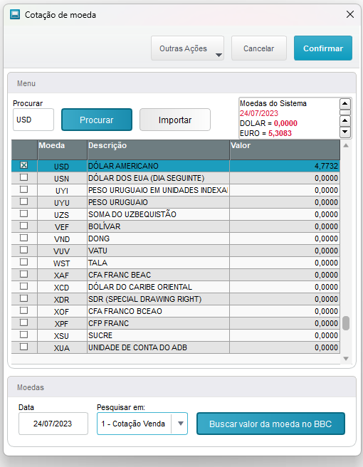
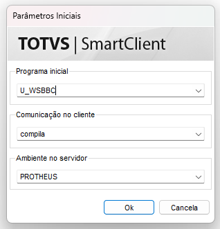
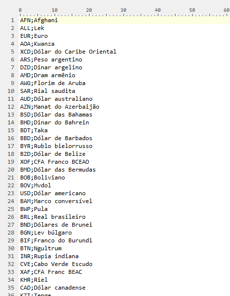

## Description
 Função criada para buscar a moeda diretamente do Banco Central
 
 

    
 

 
 1. Para executar o programa, digite na tela inicial do smartclient U_WSBBC 
 

    
 

 
 2. Importe uma lista de moedas (moedas-bbc.csv)
 

    
 

 
 4. Selecione a moeda desejada
 5. Defina a data de pesquisa
 6. Para gravar no Protheus (Tabela SM2), clique no botão "Confirmar"

##Documentação Banco Central
 Para ter acesso completo a documentação do Banco Central, acesse este link (https://dadosabertos.bcb.gov.br/dataset/taxas-de-cambio-todos-os-boletins-diarios)
